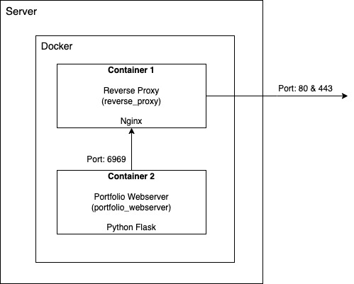

# Portfolio Website

## Status

[](https://github.com/sashuu69/portfolio-website-docker-compose/actions/workflows/docker-image.yml)

## Introduction

This repository contains the code to host personal portfolio website using docker compose. 

## Architecture



## Prerequisites

1. Server with git, docker and docker-compose installed and configured.
2. Domain DNS record connected to the target server.

## Installation Steps

1. Clone the repository under `bin/portfolio_webserver`.
    
   ```bash
   git clone https://github.com/sashuu69/portfolio_site.git bin/portfolio_webserver
   ```
3. Create an SSL certificate using the command

   ```bash
   sudo certbot certonly --standalone -d <Host URL> -d www.<Host URL>
   ```
5. Copy the SSL certificates under `config/ssl` and update `docker-compose.yaml` to connect the SSL certificates.
6. Build using the command `docker compose build` or `docker-compose build`.
7. Bring up the containers using the command `docker compose up -d` or `docker-compose up  -d`.

## Technologies Used

1. Portfolio Webserver - Python Alpine
3. Reverse Proxy - Nginx
4. Docker compose is used to create multi-container application

For information about the flask webpage, please refer to the link [sashu69/portfolio_website](https://github.com/sashuu69/portfolio_website).

## Contributors

1. Sashwat K <sashwat0001@gmail.com>

## Other Info

If you face any bugs or want to request a new feature, please create an issue under the repository and provide appropriate labels respectively. If you want to do these by yourself, feel free to raise a PR and I will do what is necessary.

If you want to support me, donations will be helpful.
